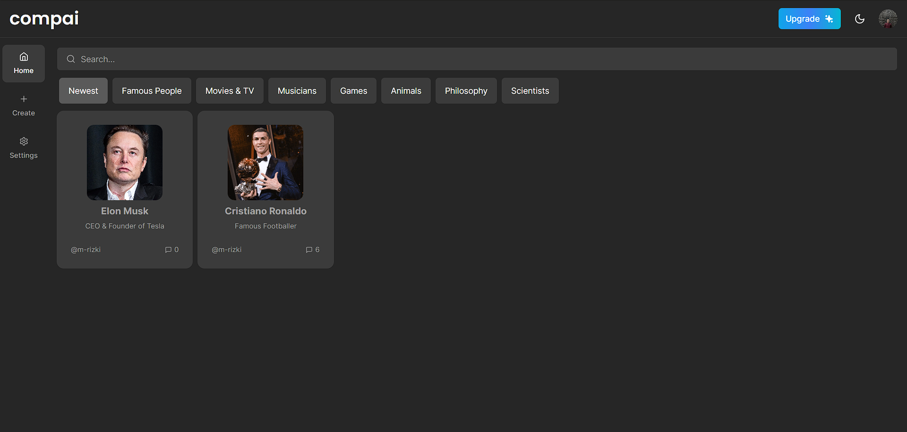

# compai (Typescript)

This is an open source SaaS AI Companion Platform. This is a [Next.js](https://nextjs.org/) project bootstrapped with [`create-next-app`](https://github.com/vercel/next.js/tree/canary/packages/create-next-app).

[](https://compai.vercel.app/)

> **Warning**
> This project is still in development and is not ready for production use.
>
> It uses new technologies (Next.Js 13 with app router, server component) which are subject to change and may break your application.

## Source

github repo : [next13-ai-companion](https://github.com/AntonioErdeljac/next13-ai-companion)

## notes

I haven't implemented the subscription feature yet, but i create an alternative way to prevent non subscription users from accessing create companion functionality

## Tech Stack

- [Next.js](https://nextjs.org)
- [Typescript](https://www.typescriptlang.org)
- [Tailwind CSS](https://tailwindcss.com)
- [shadcn ui](https://ui.shadcn.com)
- [react-hook-form](https://react-hook-form.com)
- [zod](https://zod.dev)
- [zustand](https://github.com/pmndrs/zustand)
- [Clerk](https://clerk.com)
- [PostgreSQL](https://www.postgresql.org)
- [prisma](https://www.prisma.io)

## Feature to be implemented

- [x] Tailwind design
- [x] Tailwind animations and effects
- [x] Full responsiveness
- [x] Authentication (powered by clerk)
- [x] Client form validation and handling using react-hook-form and zod
- [x] Server error handling using react-toast
- [x] Conversation Generation Tool (Open AI)
- [x] API limiting
- [x] POST, DELETE, and GET routes in route handlers (app/api)
- [x] Fetch data in server react components by directly accessing database (WITHOUT API!)
- [x] Handle relations between Server and Child components!
- [x] Reusable layouts
- [x] Folder structure in Next 13 App Router
- [ ] Page loading state

### Prerequisites

Node version 18.x.x

### Cloning the repository

```shell
git clone https://github.com/AntonioErdeljac/next13-ai-saas.git
```

### Install packages

```shell
npm i
```

### Setup .env file

```js
NEXT_PUBLIC_CLERK_PUBLISHABLE_KEY=
CLERK_SECRET_KEY=

NEXT_PUBLIC_CLERK_SIGN_IN_URL=/sign-in
NEXT_PUBLIC_CLERK_SIGN_UP_URL=/sign-up
NEXT_PUBLIC_CLERK_AFTER_SIGN_IN_URL=/
NEXT_PUBLIC_CLERK_AFTER_SIGN_UP_URL=/

DATABASE_URL=

NEXT_PUBLIC_CLOUDINARY_CLOUD_NAME=

PINECONE_INDEX=
PINECONE_ENVIRONMENT=
PINECONE_API_KEY=

UPSTASH_REDIS_REST_URL=
UPSTASH_REDIS_REST_TOKEN=

OPENAI_API_KEY=

REPLICATE_API_TOKEN=

NEXT_PUBLIC_APP_URL=http://localhost:3000
```

### Setup Prisma

Add PostgreSQL Database (I used Supabase)

```shell
npx prisma db push

```

Seed categories:

```shell
node scripts/seed.ts
```

### Start the app

```shell
npm run dev
```

## Getting Started

First, run the development server:

```bash
npm run dev
# or
yarn dev
# or
pnpm dev
```

Open [http://localhost:3000](http://localhost:3000) with your browser to see the result.

You can start editing the page by modifying `app/page.tsx`. The page auto-updates as you edit the file.

This project uses [`next/font`](https://nextjs.org/docs/basic-features/font-optimization) to automatically optimize and load Inter, a custom Google Font.

## Learn More

To learn more about Next.js, take a look at the following resources:

- [Next.js Documentation](https://nextjs.org/docs) - learn about Next.js features and API.
- [Learn Next.js](https://nextjs.org/learn) - an interactive Next.js tutorial.

You can check out [the Next.js GitHub repository](https://github.com/vercel/next.js/) - your feedback and contributions are welcome!

## Deploy on Vercel

The easiest way to deploy your Next.js app is to use the [Vercel Platform](https://vercel.com/new?utm_medium=default-template&filter=next.js&utm_source=create-next-app&utm_campaign=create-next-app-readme) from the creators of Next.js.

Check out our [Next.js deployment documentation](https://nextjs.org/docs/deployment) for more details.
